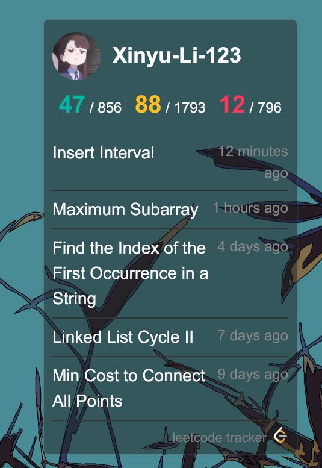

# Leetcode Tracker

This is a [Deskulpt](https://csci-shu-410-se-project.github.io/Deskulpt/) widget for tracking your Leetcode progress. It shows 

- your leetcode username

- your profile picture

- the number of easy/medium/hard problems you have solved.

- the latest 5 problems you have solved

Below is a demo of the widget.

This widget relies on a proxy server to send requests to Leetcode. The server is defined in [this repo](https://github.com/Xinyu-Li-123/leetcode-api-proxy). I personally deploy it on Vercel, but you could deploy your own if needed.

## What is Deskulpt

Deskulpt is a desktop customization tool that let's you write code to define what's on your computer desktop. It's similar to [Rainmeter](https://www.rainmeter.net/) for Windows and [Ubersicht](https://tracesof.net/uebersicht/) for MacOS, except it works cross-platformly and allows you to write widgets in React + TypeScript.